프로젝트 : 블로그 서비스
--------------
Blog Backend project with realworld.io

 

설명 : 
    
    정해진 API spec에 맞게 백엔드 서버 구현

기능 : 
 

    회원가입, 로그인(인증), 회원정보 수정 
    게시글 - 작성, 수정, 삭제
    댓글 - 작성 수정, 삭제
    팔로우, 언팔로우 
 

**기본구성 화면**

------------

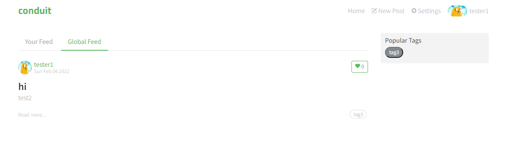

 

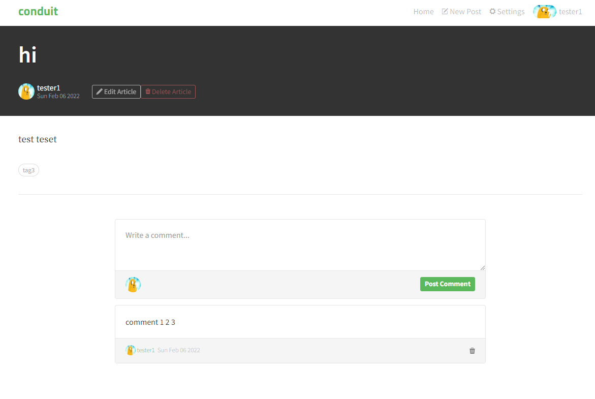

 

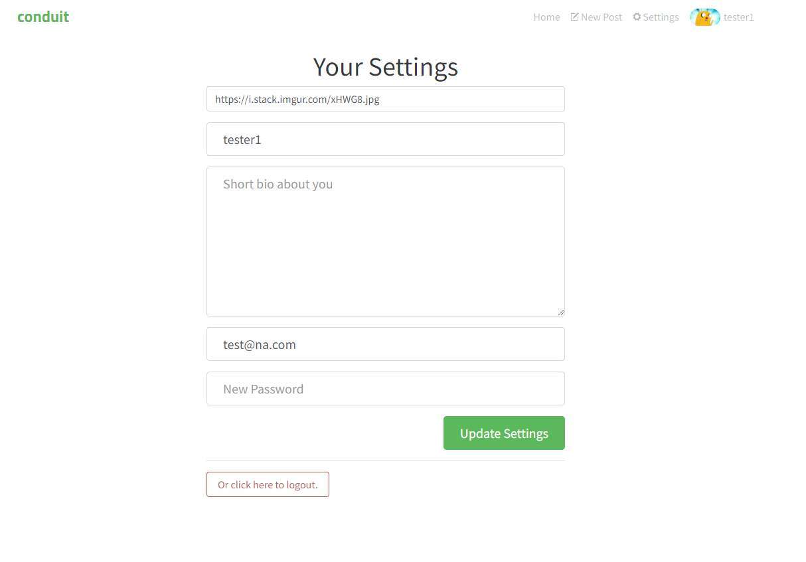

 
 

**인증 관련 : JWT**

------------

Header에 Token을 포함하여 전달

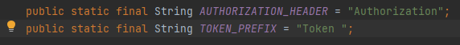
 

Token 생성

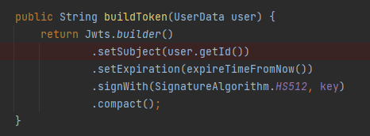

Token 유효성 확인

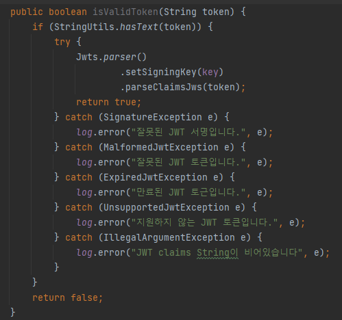

 
 

**Request / Response**

---------

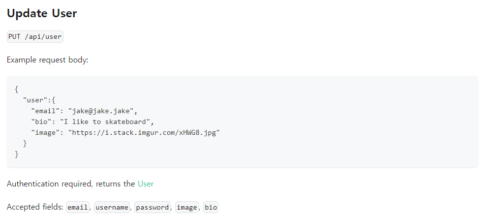

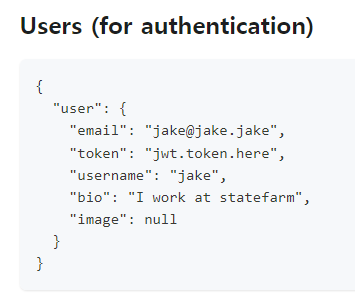

 

java/com/example/blog/api/article/ArticleApi.java

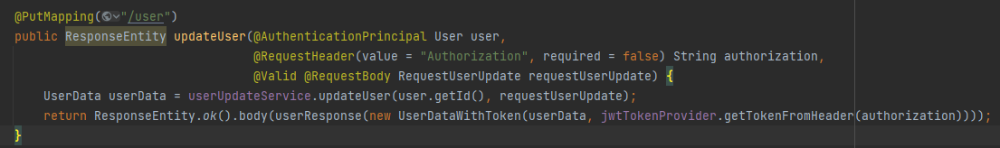

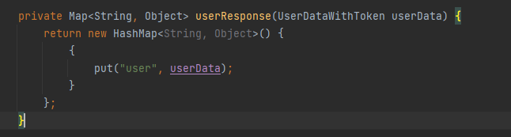

 

java/com/example/blog/service/requestDTO

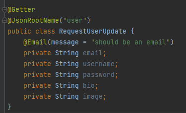

java/com/example/blog/service/responseDTO

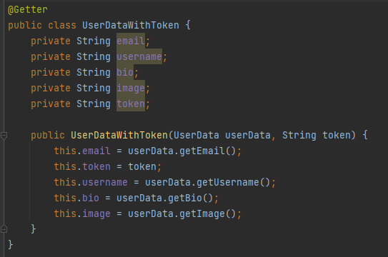

 

 
 
 

**Reference**

--------
https://github.com/gothinkster/realworld

https://realworld-docs.netlify.app/docs/specs/backend-specs/endpoints/#add-comments-to-an-article

